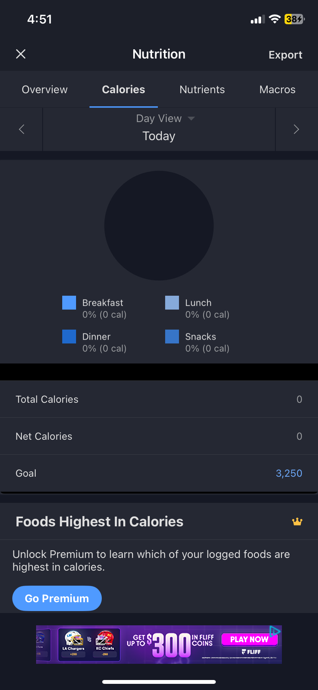
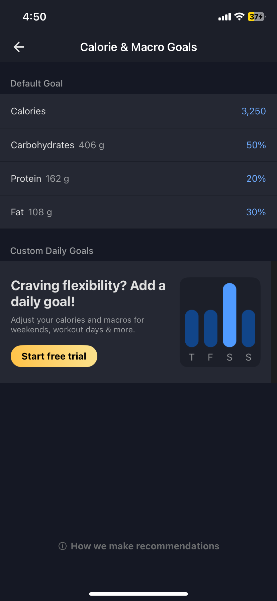
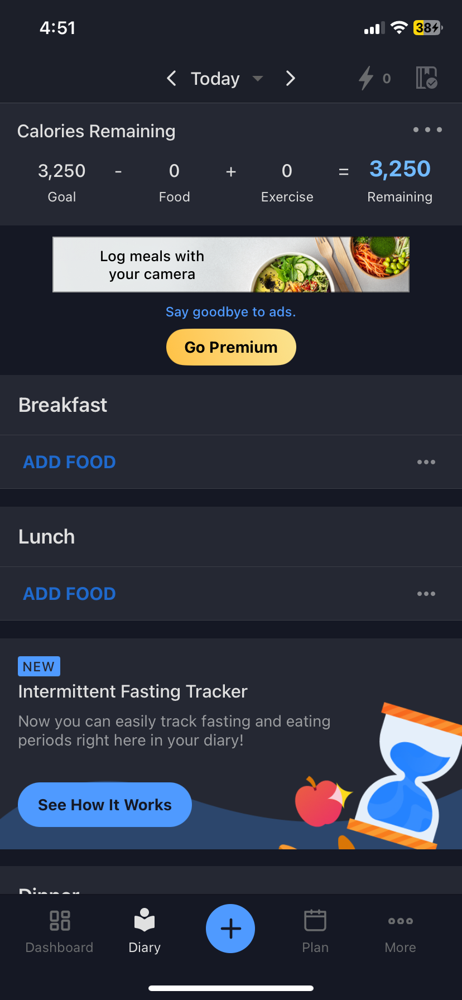
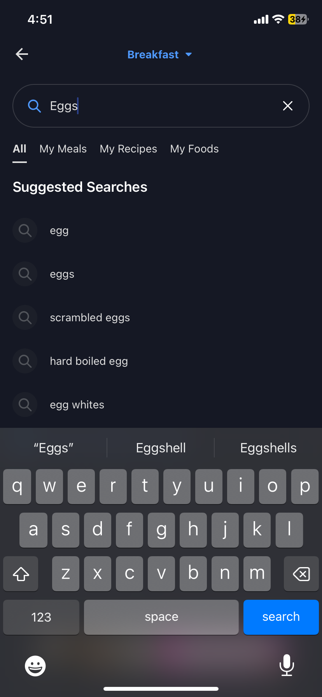
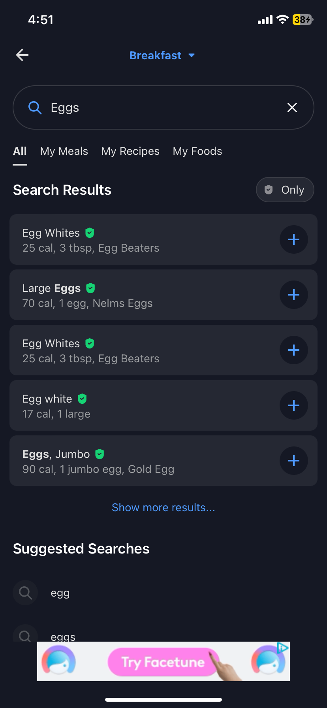
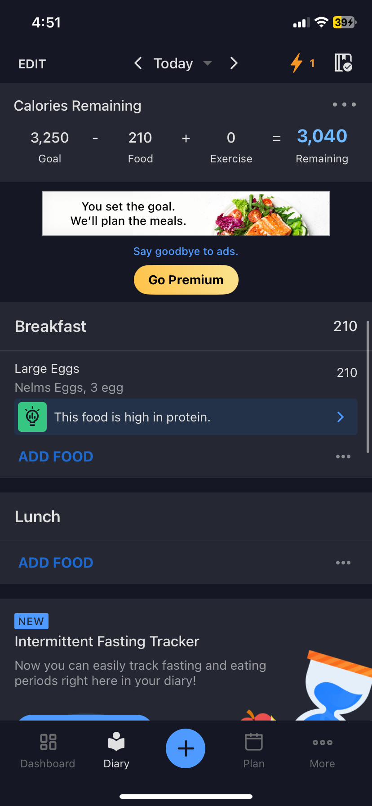

# MyFitnessPal Journal

When trying to lose, gain, or maintain one’s weight, counting calories is essential to know how much you are eating to adjust based on your preferences. Writing down each item you eat in one day and adding everything together can be a hassle, especially when you are focusing on micro and macro nutrients. So that’s why MyFitnessPal offers an application to **efficiently** log everything you eat or drink during the day. 
To start, simple open your smartphone’s app store and type in “MyFitnessPal”. Once it is downloaded, open the application and sign up for an account, or you can optionally sign up with an existing google or apple account. It will ask you if you want to lose weight, maintain weight, or gain weight and will then prompt for your sex, weight, and height. After entering that information it will calculate your daily calorie goal for you, which I found to be **satisfying**. Once logged in a dashboard screen will be displayed with your daily goal. 

To change your daily calories simply click the middle panel displaying your remaining calories, click goal, and then you have the option to adjust calories as well as your macronutrients.      

To add food to your daily journal, tap the diary icon on the bottom left of the screen. You will then be taken to a page which displays sections for breakfast, lunch, dinner, and snacks. 
To add items to your journal, click the ‘add food’ label under the time of day you would like, and then simply search in the search box of what food you would like the add.

 Click the plus icon next to the food item to prompt a new screen which will then ask for the serving size and number of servings consumed. Then click the checkmark on the top right to add the food item to your journal. 

I found the application to be error tolerant since if you make a mistake, you can simply click the food item to edit your entries, or simply swipe left  on the food item to delete the entry.

